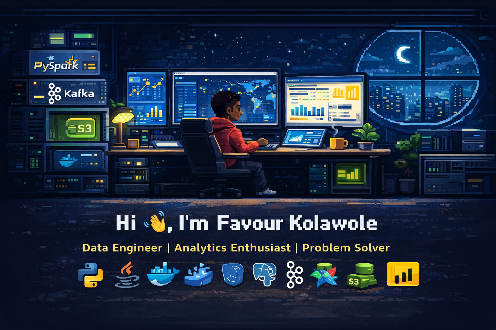

  

<h1 align="center">Hi 👋, I'm Favour Kolawole</h1>
<h3 align="center">
  Data Engineer • Analytics Enthusiast • Problem Solver
</h3>

  

---

## 👨‍💻 About Me

🌱 I work with **data engineering, analytics, and scalable data pipelines**

👨‍💻 **Portfolio:**  
👉 https://thedatamaven1985.github.io/MyPortfolio

💬 **Ask me about:**  
`Python` · `Java` · `PySpark` · `Apache Airflow` · `Kafka` · `Docker` · `AWS S3` · `Power BI`

📫 **Email:**  
✉️ **kolawolefavour20@gmail.com**

⚡ **Fun fact:** I enjoy turning raw data into meaningful insights.

---

## 🌐 Connect With Me

  

---

## 🛠 Languages & Tools

  
  
  
  
  

  
  
  
  
  

  
  
  
  
  

